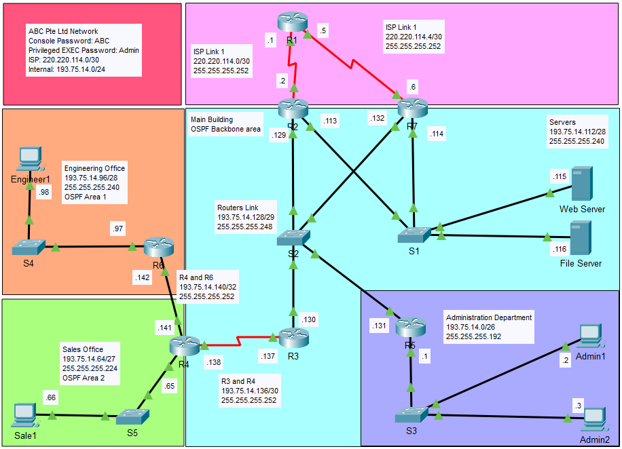
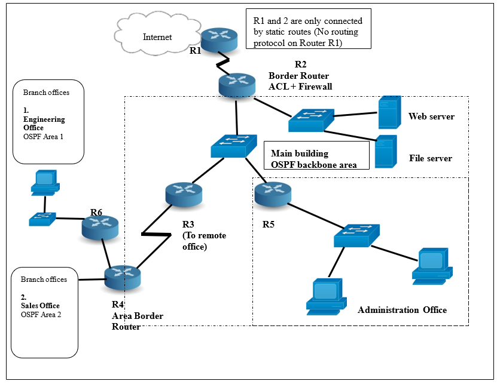

# Network-Proposal-SP

This repository contains a school project created for assignment submission. It contains a comprehensive network design and configuration project created using Cisco Packet Tracer for a fictional company. The project includes the design and implementation of network configurations, featuring **OSPF** multi-area, **HSRP** for network redundancy, and **VLSM** for efficient IP addressing.

## Scenario

ABC Pte Ltd provides comprehensive IT solutions and services, including tender management, solution identification, and project implementation. The main office in western Singapore houses the Admin department and server systems, connected to the external network via an ISP leased line. A firewall in router R2 monitors and controls traffic. The main office also connects to two remote branches (Engineering and Sales departments). The company is implementing a wired network designed to support 100% growth over the next 5 to 10 years. A Network Diagram is provided. You are tasked to design and implement the ABC Pte Ltd network.

## Company’s Requirements (Task 1 - Addressing)

- 25 employees in the Administration department  
- 9 employees in the remote Sales Office 
- 5 employees in the remote Engineering Office 
- Lifetime maximum of 6 servers on a separate subnet, regardless of company growth
- Use subnet address 220.220.114.0/30 for connection to the Internet router
- Use given address range 193.75.14.0/24 for internal addressing
- Use VLSM for IP addressing
- Expect 100% growth of current IP requirements when determining the size of subnets

| Host Address Required | Network Address | Subnet Mask | Max Possible Host | Network Name |
|:-:|:-:|:-:|:-:|:-:|
| 50 | 193.75.14.0 | 255.255.255.192 | 62 | Admin Department |
| 19 | 193.75.14.64 | 255.255.255.224 | 30 | Sale Office |
| 11 | 193.75.14.96 | 255.255.255.240 | 14 | Engineering Office |
| 9 | 193.75.14.112 | 255.255.255.240 | 14 | Servers |
| 5 | 193.75.14.128 | 255.255.255.248 | 6 | Routers Link |
| 2 | 193.75.14.136 | 255.255.255.252 | 2 | R3,R4 |
| 2 | 193.75.14.140 | 255.255.255.252 | 2 | R4,R6 |

## Company’s Requirements (Task 2 – Router Configuration)

- Apply appropriate hostnames/passwords to all routers
- Apply clock rate 64000 for serial interface where applicable
- Ensure appropriate static/default route is applied to R1 and R2
- Disable routing updates to appropriate devices
- Company would like to use OSPF for their network (OSPF Process ID 64)
- DR/BDR to be applied for multi-access network:
  - R2 to be designated as DR
  - R5 to be designated as BDR
- Multi-area OSPF to be used:
  - R2, R3, and R5 (Backbone area 0)
  - R4 (ABR – Area 0, 1, and 2)
- Use appropriate loopback address for router ID
- Ensure network redundancy for ISP given an additional Router R7 and another ISP link
- Hello and Dead time interval for Serial interface to be updated to 20 seconds and 80 seconds respectively

## Testing of Network (Task 3)

The company specifies the following network testing and is receptive to suggestions or recommendations about other testing, as well as future network improvements.

### Testing and Verifying Strategy
- Provide printout of routing table (text files) for each router
- Provide evidence of connectivity across different routers using “Ping” tests
